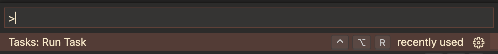
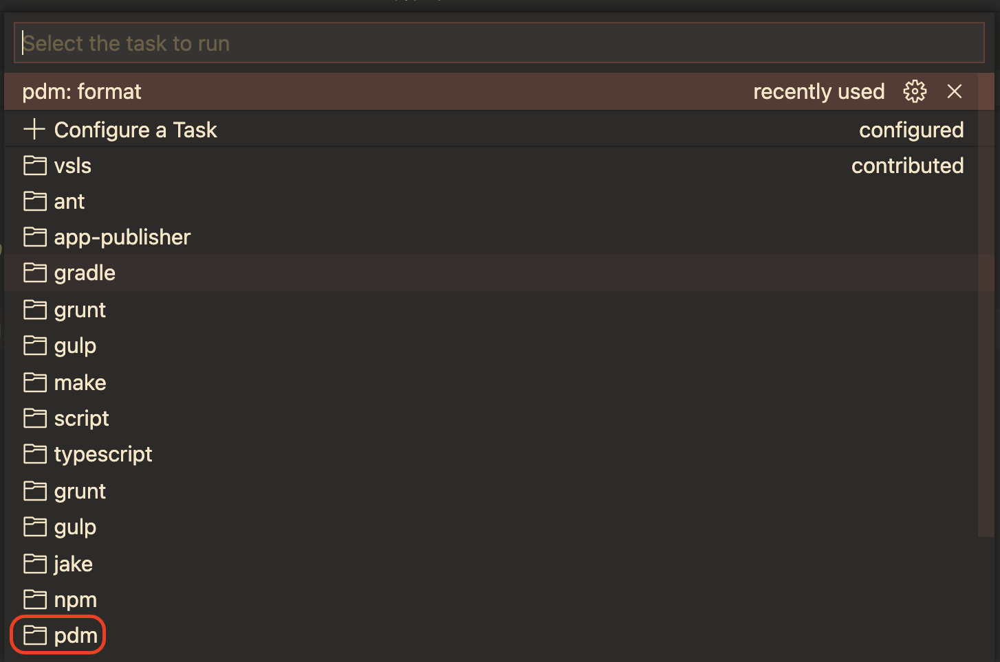
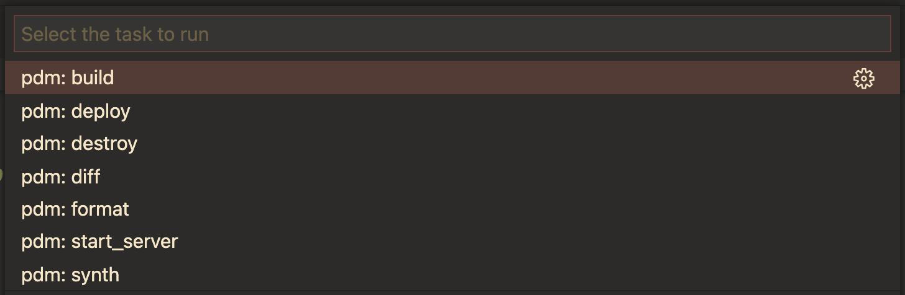

# [PDM Task Provider](https://marketplace.visualstudio.com/items?itemName=knowsuchagency.pdm-task-provider)

[**Task**][tasks] provider for [**pdm**][pdm].


[pyproject.toml]
```
[tool.pdm.scripts]
start_server = "flask run -p 54321"
```

### From Tasks Global Menu


### Select PDM


[pdm]: https://pdm.fming.dev
[tasks]: https://code.visualstudio.com/docs/editor/tasks

### Select Task from pyproject.toml


<footer>
<a href="https://iconscout.com/icons/python" target="_blank">Python Icon</a> on <a href="https://iconscout.com">Iconscout</a>
</footer>
